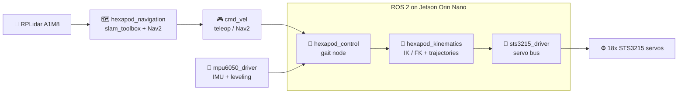

  echo "STOP: could not clone https://github.com/$OWNER/$REPO, check the owner and repo name"
else
cd hx-edit
cat > README.md <<'EOF'
<div align="center">

# 🕷️ HEXAPOD-6

### A from-scratch ROS 2 walking stack for a 6-legged robot.
**18 servos. Zero closed-source gait code.**


</div>

---

A ground-up ROS 2 software stack for a 6-legged (hexapod) walking robot, built
for a **RoSpider-shell chassis** retrofitted with different hardware than the
stock kit: a **Jetson Orin Nano**, **18x Feetech STS3215 bus servos** and an
**RPLidar A1M8**. None of these are supported by the original manufacturer's
software.

## 🎯 Why this exists

The stock robot's gait and inverse-kinematics logic ships as a **closed-source
compiled binary**. Rather than depend on that, this project implements the
full walking stack from scratch: protocol driver, inverse kinematics, gait
engine, calibration tooling, SLAM and autonomous navigation, using only open,
verifiable, from-first-principles robotics engineering.

## ⚡ Highlights

| | Feature | Details |
| --- | --- | --- |
| 🔌 | **Custom serial protocol driver** | Feetech STS3215 bus servo protocol, written and unit-tested against the actual hardware |
| 📐 | **3-DOF leg inverse kinematics** | Derived and implemented from first principles, verified numerically (**IK↔FK round-trip accuracy < 0.001 mm**) before ever touching real hardware |
| 🦿 | **Two gait engines** | Tripod and wave, with velocity-continuous foot trajectories (smootherstep easing) engineered to reduce mechanical impact and jerk on a heavier-than-stock build |
| 🎛️ | **Full hand-calibration pipeline** | Automated per-joint direction/offset solving from physically-posed reference stances, plus live diagnostic tooling (real-time joint-angle comparison plots) to tell genuine hardware faults from expected kinematic behavior |
| 🗺️ | **SLAM + Nav2 autonomous navigation** | Every costmap, controller and planner parameter re-derived from the robot's actual measured geometry and speed, not generic tutorial defaults |
| 🧠 | **Custom STM32 real-time firmware** | Evaluated as an alternative servo/IMU bridge architecture: hand-written HAL-level C, compiled and verified against ST's official toolchain |
| 🔍 | **Systematic hardware debugging** | Root-caused a disabled I2C controller via direct Linux device-tree inspection; separated real from false-positive mechanical issues using custom live telemetry visualization instead of guesswork |

## 🏗️ Architecture



```text
ROS2 (Jetson Orin Nano)
  hexapod_kinematics   leg IK/FK, gait trajectory generation (pure Python, hardware-independent)
  hexapod_control      gait control node, calibration, teleop, diagnostics
  sts3215_driver       servo bus protocol driver
  mpu6050_driver       IMU driver
  hexapod_navigation   SLAM (slam_toolbox) + Nav2 autonomous navigation
  hexapod_bringup      launch files
```

## 🔩 Hardware

| Component | Details |
| --- | --- |
| Compute | Jetson Orin Nano (JetPack 6 / ROS 2 Humble) |
| Servo driver | SmartElex Serial Bus Servo Driver Board (raw UART/USB passthrough, no onboard MCU/SDK) |
| Servos | 18x STS3215 bus servos, centered at tick 2048 |
| IMU | MPU6050 (I2C) |
| Lidar | RPLidar A1M8 |

## ⚖️ Why this isn't a literal copy of the stock RoSpider software

The stock RoSpider ROS 2 package's actual leg inverse-kinematics and gait
trajectory math live inside `kinematics.so`, a compiled ARM64 Rust extension
with no available source. It can't be copied.

**What is reused from that repo:**
- The overall control architecture (gait phase generator, `cmd_vel` handling, the "publish a batch of servo positions with a duration" pattern)
- The real leg/body geometry, pulled from the official `rospider_description` URDF (coxa **45.0 mm** / femur **77.1 mm** / tibia **115.6 mm**, plus each leg's mount position and yaw angle), which is legitimate since the same shell is used
- The servo-abstraction pattern (per-joint direction / offset / center → tick conversion)

**Everything else is written from scratch** with open, standard robotics math:
the STS3215 protocol driver, the 3-DOF leg IK, the tripod/wave gait engine and
the IMU leveling. It's verified numerically (see `hexapod_kinematics`): IK/FK
round-trips to < 0.001 mm error, and a full gait cycle across all 18 servos
stays within safe tick range with zero unreachable targets.

## 📦 Packages

| Package | Purpose |
| --- | --- |
| `hexapod_msgs` | `ServoPosition` / `ServosPosition` messages |
| `sts3215_driver` | Feetech SCServo/STS protocol over serial, ROS 2 node |
| `hexapod_kinematics` | Pure-Python leg IK/FK + gait trajectory generator (no ROS dependency, unit-testable) |
| `mpu6050_driver` | MPU6050 I2C driver + complementary filter, publishes `sensor_msgs/Imu` and roll/pitch |
| `hexapod_control` | Gait control node, calibration loader, stand-up helper, keyboard teleop, servo bring-up check |
| `hexapod_navigation` | SLAM (`slam_toolbox`) + Nav2 autonomous navigation |
| `hexapod_bringup` | Launch files |

---

## 🚀 Getting started

### 1. Install dependencies (on the Jetson)

```bash
sudo apt install python3-pip python3-smbus i2c-tools
pip3 install pyserial pyyaml smbus2 --break-system-packages
sudo apt install ros-humble-tf-transformations
```

Enable I2C and add your user to the `dialout` (serial) and `i2c` groups:

```bash
sudo usermod -aG dialout,i2c $USER   # log out/in after this
```

### 2. Build

```bash
cd ~/rospider_custom_ws
colcon build --symlink-install
source install/setup.bash
```

### 3. Bring-up sequence

> ⚠️ **Do this in order, with the robot propped up off the ground first.**

#### 3a. Confirm every servo responds and IDs are correct

```bash
ros2 run hexapod_control servo_check /dev/ttyACM0
```

The SmartElex board enumerated as `/dev/ttyACM0` on the test hardware. Double
check with `ls /dev/ttyACM*` in case yours differs.

All 18 IDs should report OK. If any are missing, check that servo's wiring
before doing anything else. Do not proceed with a leg that isn't responding.

#### 3b. Check I2C sees the MPU6050

```bash
i2cdetect -y 1
```

> **Known issue:** in testing on this exact hardware, the MPU6050 was **not
> detected**: bus 1 came up empty, and a lengthy investigation through the
> Jetson's device tree (several other I2C buses, including one disabled at the
> hardware level for this header pin group) didn't fully resolve it. If you hit
> the same wall, it isn't necessarily something you're doing wrong. Re-check
> wiring continuity with a multimeter and confirm which physical header pins
> your Orin Nano carrier board actually routes to which `/dev/i2c-N`, since
> that mapping isn't always what the board's silkscreen implies.

#### 3c. Prop the robot up and stand up

```bash
ros2 run hexapod_control stand_up --ros-args -p config_path:=install/hexapod_control/share/hexapod_control/config/servo_config.yaml
```

Watch closely. Each leg should rise smoothly to a symmetric splayed stance.

**If any leg moves the wrong way** (coxa swings inward instead of outward,
femur/tibia fold instead of extend, etc.), stop and flip that joint's
`direction` from `1` to `-1` (or vice versa) in
`hexapod_control/config/servo_config.yaml`, rebuild, and try again. This is
expected: the shipped defaults are reasonable mirrored-leg guesses, but exact
assembly and wiring may differ.

#### 3d. Fine-trim with `offset_deg`

Once directions are correct, if a leg's stance isn't quite symmetric (e.g.
tibia not fully extended-looking, coxa not pointing exactly outward), nudge
that joint's `offset_deg` a few degrees at a time and re-run `stand_up` until
it looks right. This compensates for the servo horn not landing exactly on
the kinematic zero when centered at 2048.

#### 3e. Walk

With the robot still safely propped up (do the first test off the ground!):

```bash
# terminal 1
ros2 launch hexapod_bringup walk.launch.py

# terminal 2
ros2 launch hexapod_bringup teleop.launch.py
```

| Key | Action |
| --- | --- |
| `w` `a` `s` `d` | Move |
| `q` `e` | Turn |
| `space` | Stop |

Once you're confident it walks correctly in the air, set it down.

## 🎚️ Tuning parameters

All settable via `ros2 launch ... gait:=... step_period_s:=...` or by editing the launch file.

| Parameter | What it does |
| --- | --- |
| `gait` | `tripod` (fast, 3 legs airborne at once) or `wave` (slow, 1 leg airborne at a time, more stable) |
| `step_period_s` | Seconds per full gait cycle |
| `lift_height_mm` / `stance_height_mm` / `stance_radius_mm` | Gait node parameters, see `gait_node.py` |
| `leveling_enabled` / `leveling_gain` | IMU-based body leveling. Set `leveling_gain` to `0` to disable if it oscillates, or lower it (default `0.6`) |

## 🚧 Known gaps / next steps

- [ ] **MPU6050 detection:** unresolved on this hardware (see 3b)
- [ ] **URDF / RViz visualization:** none yet for this hexapod build (`geometry.py` has everything needed to build one)
- [ ] **Faster servo feedback:** `sts3215_driver` reads positions back sequentially at ~20 Hz for `joint_raw_states`. That's fine for monitoring, but `SYNC_READ` (`0x82`) would be faster and more reliable than one `READ` per servo
- [ ] **Verify control-table addresses:** double check the STS3215 addresses in `scservo_protocol.py` against your exact servo firmware's datasheet before full-torque operation. They're correct for the standard/common STS3215 memory map, but Feetech has shifted a register or two between firmware revisions in the past

---

<div align="center">

**Built from first principles. Debugged with telemetry, not guesswork.** 🕷️

</div>
